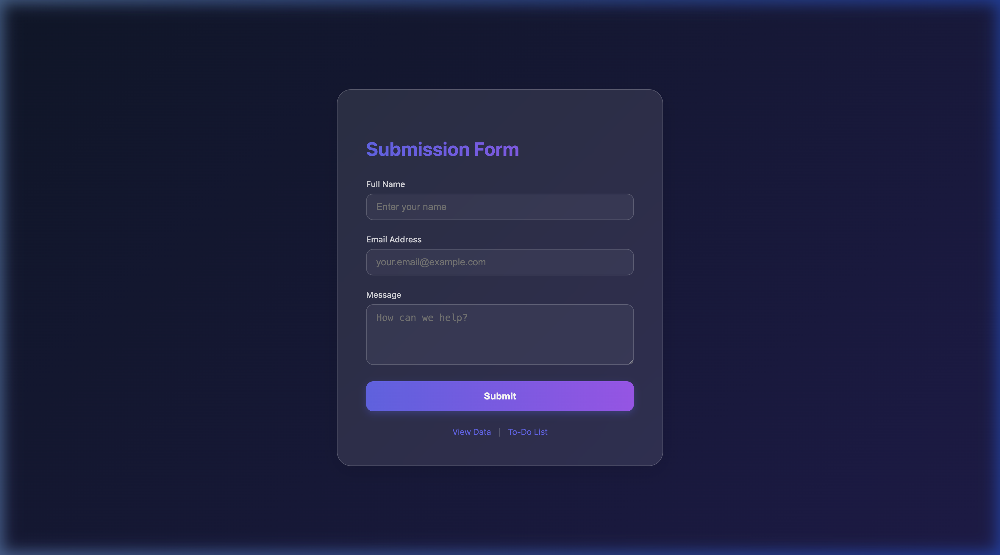
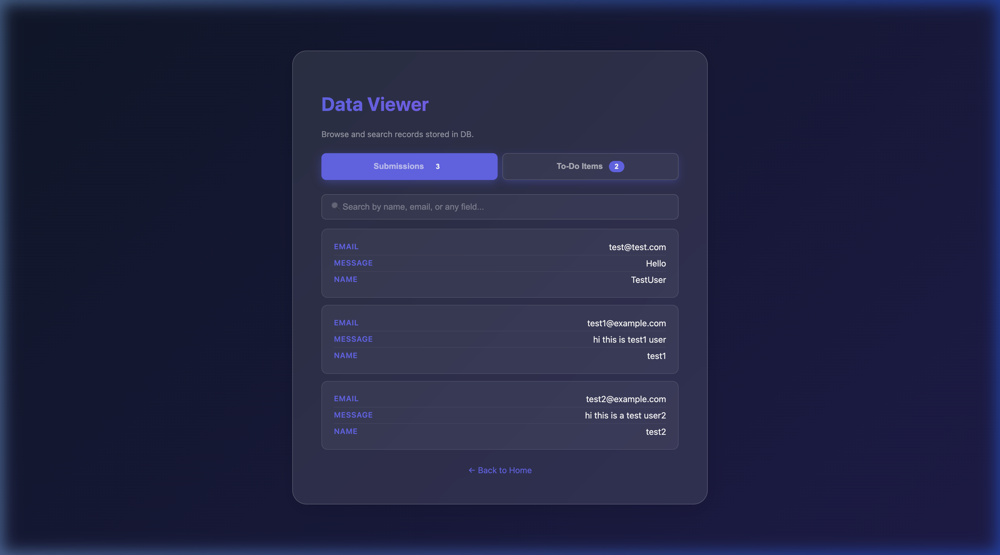
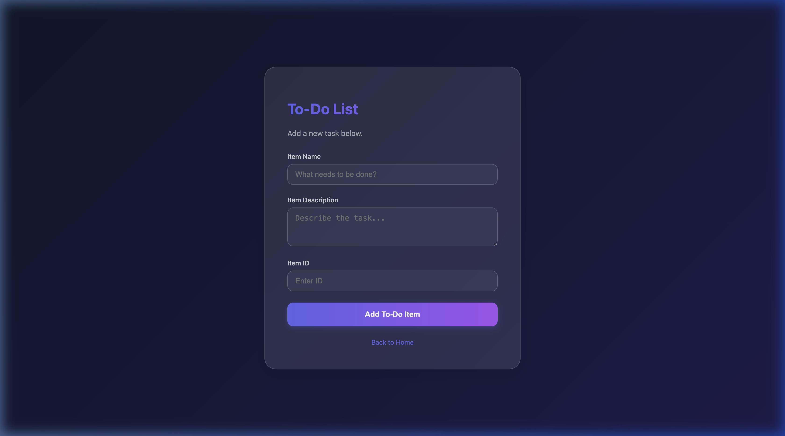
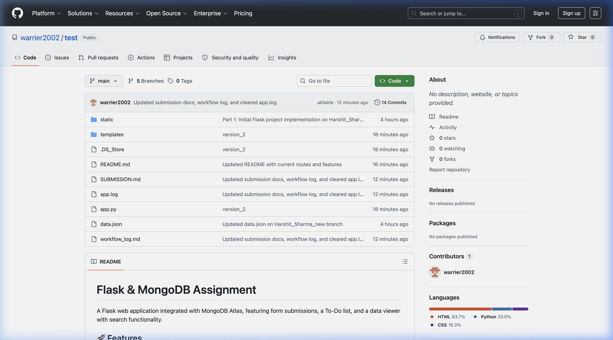

# Flask & MongoDB Assignment

A Flask web application integrated with MongoDB Atlas, featuring form submissions, a To-Do list, and a data viewer with search functionality.

## 🚀 Features

- **API Endpoint** (`/api`): Returns JSON data read from a backend `data.json` file.
- **Submission Form** (`/`): Collects Name, Email, and Message — inserts into MongoDB Atlas. Redirects to a success page on success, or shows the error on the same page.
- **To-Do List** (`/todo`): Add tasks with Item Name, Item Description, and Item ID — stored in MongoDB.
- **Data Viewer** (`/viewdata`): Browse all records from the database with tabs for Submissions and To-Do Items, plus live search filtering.
- **Success Page** (`/success`): Displays "Data submitted successfully" after a valid form submission.

## 📸 Screenshots

| Home Page | Data Viewer |
|:---:|:---:|
|  |  |

| To-Do Page | GitHub Repository |
|:---:|:---:|
|  |  |


## 🛠 Tech Stack

- **Backend**: Python, Flask
- **Database**: MongoDB Atlas (pymongo)
- **Frontend**: HTML5, CSS (Glassmorphism design), Jinja2, JavaScript

## 📁 Project Structure

```
├── app.py               # Flask application with all routes
├── data.json             # Backend JSON data for /api route
├── static/
│   └── style.css         # CSS styles
├── templates/
│   ├── index.html        # Home page with submission form
│   ├── todo.html         # To-Do list form
│   ├── success.html      # Success redirect page
│   └── viewdata.html     # Data viewer with search
├── screenshots/          # Application screenshots
├── git_log.txt           # Detailed git history log
└── README.md
```

## ⚙️ Setup & Run

```bash
# Clone
git clone git@github.com:warrier2002/test.git
cd test

# Install dependencies
pip install Flask pymongo python-dotenv

# Setup environment variables
# 1. Copy the template
cp .env.example .env
# 2. Edit .env and add your real MongoDB connection string
nano .env 

# Run
python3 app.py
```

The app runs at **http://localhost:5001**

## 📊 Routes

| Route | Method | Description |
|---|---|---|
| `/` | GET | Home page with submission form |
| `/api` | GET | Returns JSON list from data.json |
| `/submit` | POST | Inserts form data into MongoDB |
| `/todo` | GET | To-Do list form |
| `/submittodoitem` | POST | Inserts To-Do item into MongoDB |
| `/viewdata` | GET | Data viewer with search & filter |
| `/api/alldata` | GET | Returns all MongoDB data as JSON |
| `/success` | GET | Success confirmation page |

## 🌿 Git Workflow

This repository demonstrates an advanced Git workflow:
1. **Branching & Merging**: `Harshit_Sharma` → `main`
2. **Conflict Resolution**: `Harshit_Sharma_new` merged with conflict resolved
3. **Parallel Development**: `master_1` (frontend) + `master_2` (backend) → `main`
4. **Soft Reset & Rebase**: Sequential commits, `git reset --soft`, and `git rebase`

## 📜 Git History & Submission Logs

To provide full transparency and meet submission requirements, this repository includes the following logs:

*   **[SUBMISSION.md](SUBMISSION.md)**: The primary submission cover sheet with feature highlights.
*   **[git_log.txt](git_log.txt)**: A raw export of the complete Git history (`git log --all`), including branch merges and rebase activity.
*   **[workflow_log.md](workflow_log.md)**: A detailed, step-by-step account of the entire development workflow across all assignment tasks.

---
**Author**: Harshit Sharma
